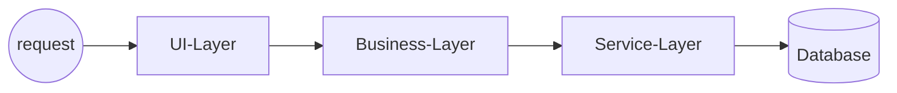

#### What
The concept of an **"architecture sinkhole"** refers to the practice of designing software or systems in such a way that they consume significant resources while providing limited benefits or value. 

It can be described as a structure that does not perform its intended function well and instead creates a waste of time, money, or energy.

In software development, architecture sinkholes can occur when developers design systems with complex, over-engineered architectures that are difficult to maintain or modify. These architectures often require extensive resources, such as human expertise, time, and financial investment, but they may not provide any significant benefits to the organization or end-users.

Another type of architecture sinkhole is when a system fails to meet its intended requirements or goals, resulting in wasted effort, time, and money. This can happen for a variety of reasons, including poor design, faulty implementation, or inadequate resources.

Overall, an architecture sinkhole refers to any situation where a software or systems design fails to deliver the expected results or value, causing waste and inefficiency.

#### Example:
In an N-layered architecture, when a request passes from the User Interface (UI) layer directly to the Persistent Layer without incorporating any business rules in either the Business or Service Layers, the purpose of these layers during that request cycle is merely to create objects. ==This can result in unnecessary memory usage as objects are created but not utilized beyond their creation process==."

#### What tradeoffs to consider
Maintain an oversight of your N-layered architecture to ensure that no more than 20% of your endpoints have sinkholes. If this percentage exceeds, consider a strategic reconfiguration of your architecture.
